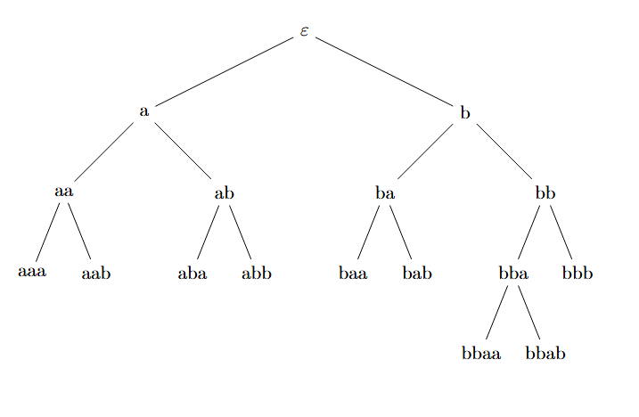

# Отчет по лабораторной работе №1

**Мой вариант:**

1. baaa → aaab
2. aabb → abab  
3. aa → bab
4. aaab → ab
5. bbb → b

## 1) Система не завершима

Возьмем три правила:

1. baaa → aaab
2. aaab → ab  
3. aa → bab

Применим к левым частям 1 и 2 правила третье правило, получим:

1. babab → aaab
2. bbaba → aaab
3. babab → ab
4. ababb → ab
5. aa → bab

Теперь по аналогии с предыдущим действием применим к левой части первого правила третье правило, получим:

ab → aaab

babab → ab

Первое правило образует цикл, следовательно, система не завершима.

## 2) Конечность

Чтобы упростить задачу, я принял фундированный порядок — лексикографический порядок получил:

1. baaa → aaab
2. abab → aabb
3. bab → aa
4. aaab → ab
5. bbb → b

Далее я написал алгоритм пополнения правил по Кнуту–Бендиксу, он находится в [ReplenishmentAlgorithm](ReplenishmentAlgorithm/src/main.ts). Применив его, получил следующую систему:

1. baaa → aaab
2. abab → aabb
3. bab → aa
4. aaab → ab
5. bbb → b
6. aaa → aa
7. abb → aa
8. bbaa → aa
9. aab → ab
10. baa → ab
11. aba → ab
12. abaa → ab
13. aabb → aaa

Далее минимизирую данную систему. Очевидно, что минимизировать правила длиной 3 нельзя, поэтому рассмотрим только правила 1, 2, 4, 8, 12, 13.

**1:** baaa → aaab — если мы применим любое из возможных правил к левой части, то правую часть мы в любом случае не получим, так как из меньшего не может получиться большее. Поэтому правило 1 сохраняется.

**2:** abab → aabb — аналогично правилу 1.

**4:** a**aab** → ab — можем применить правило 9, получим aab → ab. Это и есть правило 9, следовательно, правило 4 сокращается.

**8:** b**baa** → aa — можем применить правило 10, получим bab → aa. Это правило 3, следовательно, правило 8 сокращается.

**12:** **aba**a → ab — применяем правило 11, получим aba → ab. Это и есть правило 11, следовательно, правило 12 сокращается.

**13:** a**abb** → aaa — применяется правило 7, получим aaa → aaa, следовательно, правило 13 сокращается.

### Итог: финальная минимизированная система имеет вид:

1. baaa → aaab
2. abab → aabb  
3. bab → aa
4. bbb → b
5. aaa → aa
6. abb → aa
7. aab → ab
8. baa → ab
9. aba → ab

### Построим дерево

Как мы видим, все конечные вершины дерева переписываются по какому-либо правилу, следовательно, система конечна!

## 3) Фаззинг-тестирование

[FuzzingTest](FazzingTest/src/main.ts)

## 4) Инварианты

Удалось найти только два тривиальных инварианта:

1. Чётность количества символов 'b'
2. (количество_символов_a + длина_строки) mod 2

[MetamorfTest](MetamorfTest/src/main.ts)