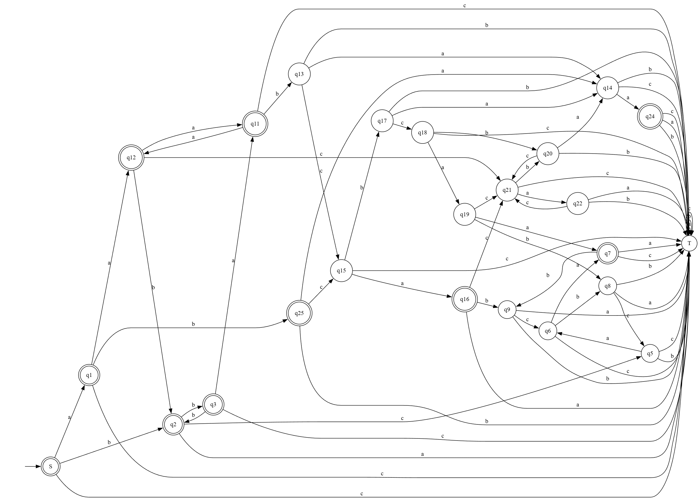
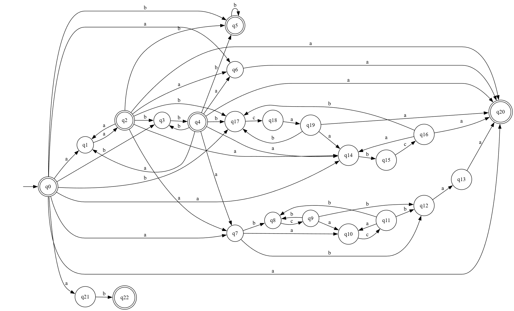
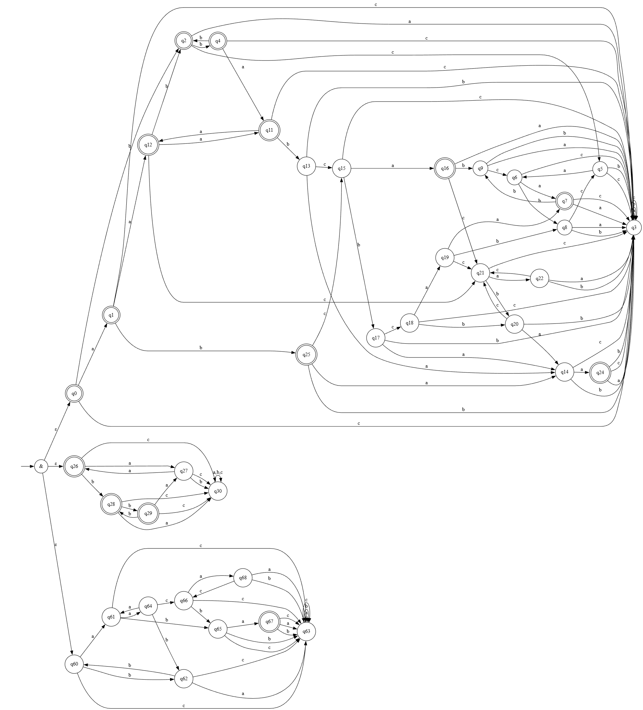

# Лабораторная работа №2

## Регулярное выражение
$`((aa | bb)^*)(b^* | (a | a((bc | ac)^*b)a | (abc | bca)^*)a) | ab`$

## Задание

По имеющемуся академическому регулярному выражению построить:
- минимальный ДКА, распознающий его язык (минимальность обосновать таблицей классов эквивалентности)
- возможно малый НКА, распознающий его язык. Возможно малый переключающийся (с конъюнкцией) КА, распознающий его язык. Частично обосно- вать таблицами множеств классов эквивалентности.
- расширенное регулярное выражение, распознающее тот же язык.

## DFA

### Таблица эквивалентностей для ДКА

В последущих таблицах, если на этапе очередного суффикса мы видим, что строка для определенного префикса уже уникальна, при проверки последущих суффиксов на этой строке в дальнейшем я ставлю 0, так более наглядна уникальность.

| prefix\suffix | ε  | a  | b  | c  | aa | ab | ba | bb | aaa | aab | abb | baa | bca | caa | abca | cbaa | aabca | acbaa | cabca |
|:---------------|----|----|----|----|----|----|----|----|-----|-----|-----|-----|-----|-----|------|------|-------|-------|-------|
| ε (0)         | +  | +  | +  | -  | +  | +  | -  | +  | 0   | 0   | 0   | 0   | 0   | 0   | 0    | 0    | 0     | 0     | 0     |
| a (1)         | +  | +  | +  | -  | +  | +  | -  | -  | 0   | 0   | 0   | 0   | 0   | 0   | 0    | 0    | 0     | 0     | 0     |
| b (2)         | +  | -  | +  | 0  | 0  | 0  | 0  | 0  | 0   | 0   | 0   | 0   | 0   | 0   | 0    | 0    | 0     | 0     | 0     |
| c (3)         | -  | -  | -  | -  | -  | -  | -  | -  | -   | -   | -   | -   | -   | -   | -    | -    | -     | -     | -     |
| bb (4)        | +  | +  | +  | -  | +  | -  | -  | +  | +   | +   | -   | -   | -   | -   | +    | -    | 0     | 0     | 0     |
| bc (5)        | -  | -  | -  | -  | +  | -  | -  | -  | -   | -   | -   | -   | -   | -   | -    | -    | 0     | 0     | 0     |
| bca (6)       | -  | +  | -  | -  | -  | -  | -  | -  | -   | -   | -   | -   | -   | -   | +    | -    | 0     | 0     | 0     |
| bcaa (7)      | +  | -  | -  | -  | -  | -  | -  | -  | -   | -   | -   | -   | +   | -   | -    | -    | 0     | 0     | 0     |
| bcab (8)      | -  | -  | -  | -  | -  | -  | -  | -  | -   | -   | -   | -   | -   | +   | 0    | 0    | 0     | 0     | 0     |
| bcaab (9)     | -  | -  | -  | -  | -  | -  | -  | -  | -   | -   | -   | -   | -   | -   | -    | -    | -     | -     | +     |
| bba (11)      | +  | +  | -  | 0  | 0  | 0  | 0  | 0  | 0   | 0   | 0   | 0   | 0   | 0   | 0    | 0    | 0     | 0     | 0     |
| aa (12)       | +  | +  | +  | -  | +  | -  | -  | +  | +   | +   | -   | -   | -   | -   | +    | +    | 0     | 0     | 0     |
| bbab (13)     | -  | -  | -  | -  | +  | -  | -  | -  | -   | -   | -   | -   | -   | -   | -    | +    | -     | -     | +     |
| aba (14)      | -  | +  | -  | -  | -  | -  | -  | -  | -   | -   | -   | -   | -   | -   | -    | 0    | 0     | 0     | 0     |
| abc (15)      | -  | +  | -  | -  | -  | -  | -  | -  | -   | -   | -   | +   | 0   | 0   | 0    | 0    | 0     | 0     | 0     |
| abca (16)     | +  | -  | -  | -  | -  | -  | -  | -  | -   | -   | -   | -   | +   | -   | -    | +    | 0     | 0     | 0     |
| abcb (17)     | -  | -  | -  | -  | +  | -  | -  | -  | -   | -   | -   | -   | -   | +   | 0    | 0    | 0     | 0     | 0     |
| abcbc (18)    | -  | -  | -  | -  | +  | -  | -  | -  | -   | -   | -   | +   | 0   | 0   | 0    | 0    | 0     | 0     | 0     |
| abcbca (19)   | -  | +  | -  | -  | -  | -  | -  | -  | -   | -   | -   | -   | -   | -   | +    | +    | 0     | 0     | 0     |
| abcbcb (20)   | -  | -  | -  | -  | +  | -  | -  | -  | -   | -   | -   | -   | -   | -   | -    | +    | -     | -     | -     |
| aac (21)      | -  | -  | -  | -  | -  | -  | -  | -  | -   | -   | -   | +   | 0   | 0   | 0    | 0    | 0     | 0     | 0     |
| aaca (22)     | -  | -  | -  | -  | -  | -  | -  | -  | -   | -   | -   | -   | -   | -   | -    | +    | 0     | 0     | 0     |
| abaa (24)     | +  | -  | -  | -  | -  | -  | -  | -  | -   | -   | -   | -   | -   | 0   | 0    | 0    | 0     | 0     | 0     |
| ab (25)       | +  | -  | -  | -  | +  | 0  | 0  | 0  | 0   | 0   | 0   | 0   | 0   | 0   | 0    | 0    | 0     | 0     | 0     |

## НКА

Частичная таблица, для минимальности НКА:

| state\suffix | ε  | a  | b  | c  | aa | ab | ba | bb | aaa | aab | abb | baa | bca | caa | abca | cbaa | aabca | acbaa | cabca |
|--------------|----|----|----|----|----|----|----|----|-----|-----|-----|-----|-----|-----|------|------|-------|-------|-------|
| q0 (ε)       | +  | +  | +  | -  | +  | +  | 0  | 0  | 0   | 0   | 0   | 0   | 0   | 0   | 0    | 0    | 0     | 0     | 0     |
| q1 (a)       | -  | +  | -  | -  | +  | 0  | 0  | 0  | 0   | 0   | 0   | 0   | 0   | 0   | 0    | 0    | 0     | 0     | 0     |
| q2 (aa)      | +  | +  | +  | -  | +  | -  | -  | +  | +   | +   | -   | -   | -   | -   | +    | -    | -     | -     | -     |
| q3 (b)       | -  | -  | +  | -  | -  | -  | +  | 0  | 0   | 0   | 0   | 0   | 0   | 0   | 0    | 0    | 0     | 0     | 0     |
| q4 (bb)      | +  | +  | +  | -  | +  | -  | -  | +  | +   | +   | -   | -   | -   | -   | +    | -    | -     | -     | -     |
| q5 (b)       | +  | -  | +  | 0  | 0  | 0  | 0  | 0  | 0   | 0   | 0   | 0   | 0   | 0   | 0    | 0    | 0     | 0     | 0     |
| q6 (a)       | -  | +  | -  | -  | -  | -  | -  | -  | -   | -   | -   | -   | -   | -   | -    | -    | -     | -     | -     |
| q7 (a)       | -  | -  | -  | -  | -  | -  | -  | -  | -   | -   | -   | +   | -   | -   | -    | -    | -     | +     | -     |
| q8 (ab)      | -  | -  | -  | -  | -  | -  | -  | -  | -   | -   | -   | -   | -   | -   | -    | +    | -     | -     | -     |
| q9 (abc)     | -  | -  | -  | -  | -  | -  | -  | -  | -   | -   | -   | +   | -   | -   | -    | -    | -     | +     | -     |
| q10 (aa)     | -  | -  | -  | -  | -  | -  | -  | -  | -   | -   | -   | -   | -   | -   | -    | +    | -     | -     | -     |
| q11 (aac)    | -  | -  | -  | -  | -  | -  | -  | -  | -   | -   | -   | +   | -   | -   | -    | -    | -     | +     | -     |
| q12 (ab)     | -  | -  | -  | -  | +  | -  | -  | -  | -   | -   | -   | -   | -   | -   | -    | -    | -     | 0     | 0     |
| q13 (aba)    | -  | +  | -  | -  | -  | -  | -  | -  | -   | -   | -   | -   | -   | -   | -    | -    | -     | -     | -     |
| q14 (a)      | -  | -  | -  | -  | -  | -  | -  | -  | -   | -   | -   | -   | +   | 0   | 0    | 0    | 0     | 0     | 0     |
| q15 (ab)     | -  | -  | -  | -  | -  | -  | -  | -  | -   | -   | -   | -   | -   | -   | -    | -    | 0     | 0     | 0     |
| q16 (abc)    | -  | +  | -  | -  | -  | -  | -  | -  | -   | -   | -   | -   | -   | -   | +    | -    | -     | -     | -     |
| q17 (b)      | -  | -  | -  | -  | -  | -  | -  | -  | -   | -   | -   | -   | -   | +   | 0    | 0    | 0     | 0     | 0     |
| q18 (bc)     | -  | -  | -  | -  | +  | -  | -  | -  | -   | -   | -   | -   | -   | -   | -    | -    | +     | 0     | 0     |
| q19 (bca)    | -  | +  | -  | -  | -  | -  | -  | -  | -   | -   | -   | -   | -   | -   | +    | -    | -     | -     | -     |
| q20 (a)      | +  | -  | -  | -  | -  | -  | -  | -  | -   | -   | -   | -   | -   | -   | -    | -    | -     | -     | -     |
| q21 (a)      | -  | -  | +  | -  | -  | -  | -  | 0  | 0   | 0   | 0   | 0   | 0   | 0   | 0    | 0    | 0     | 0     | 0     |
| q22 (ab)     | +  | -  | -  | -  | -  | -  | -  | -  | -   | -   | -   | -   | -   | -   | -    | -    | -     | -     | -     |

## ПКА

Я изучил принцип работы ПКА и на его основе сделал такой автомат. Говоря простыми словами, один из вариантов реализации ПКА — это найти инварианты регулярного выражения и на их основе построить ещё одну ветку автомата. Так как я не смог найти более-менее сложных инвариантов, то я сделал два несложных и получил в итоге такой автомат.

Сами инварианты заключаются в:

1. `(aa|bb)* b*`

2. `(aa|bb)*a (ac)* b a`,
где между двумя a находится последовательность `(ac)*b`, принимается. Все `c` на нечётных позициях относительно начала слова, после последнего `c` идёт `b`, затем `a`.

## Расширенное регулярное выражение

Изначальное регулярное выражение, с добавлением маркеров начала и конца:

$`\hat{}((aa | bb)*)(b* | (a | a((bc | ac)*b)a | (abc | bca)*)a) | ab$`$

Далее обратим внимание на часть `(bc | ac)` можем заменить ее на `([ab]c)` получим выражение:

$`\hat{}((aa | bb)*)(b* | (a | a(([ab]c)*b)a | (abc | bca)*)a) | ab$`$

Больше вариантов изменений найти не удалось.
Просто сама регулярка разбивается на довольно много элементарных выражений

`((aa|bb)*)` это мы упростить или преобразовать никак не можем 

`(b* | (a | a((bc | ac)*b)a | (abc | bca)*)a)` эта часть тоже разбивается на несколько 

`b*` , `(a | a((bc | ac)*b)a | (abc | bca)*)a` далее 

`a | a((bc | ac)*b)a | (abc | bca)*` , `a` далее 

`a`, `a((bc | ac)*b)a` , `(abc | bca)*` ни обычные `a` или `b*` ни `(abc | bca)*` мы никак преобразовать не можем ( или преобразование только усложнит регулярное выражение )

Остается только `a((bc | ac)*b)a` опять же можно сказать, что тут перед последнем `a` должно идти `b`, но это только опять же усложнит, поэтому остается единственное нормальное преобразование `(bc | ac)` -> `([ab]c)`, просто в этом куске можно сделать полный позиционный контроль, но опять же, это только усложняет регулярку `a(?<=^a)([ab]c)*(?<=c)b(?=a)a`

### Тестирование ###

[FuzzTest](FuzzTest/src/main.ts).