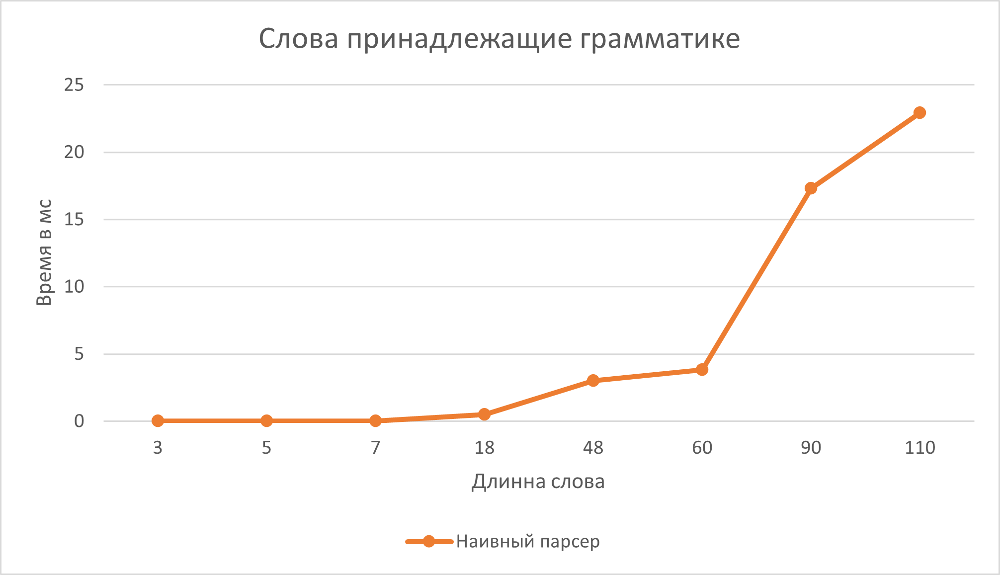
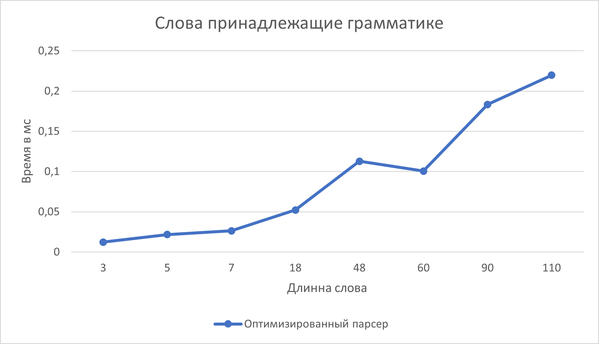
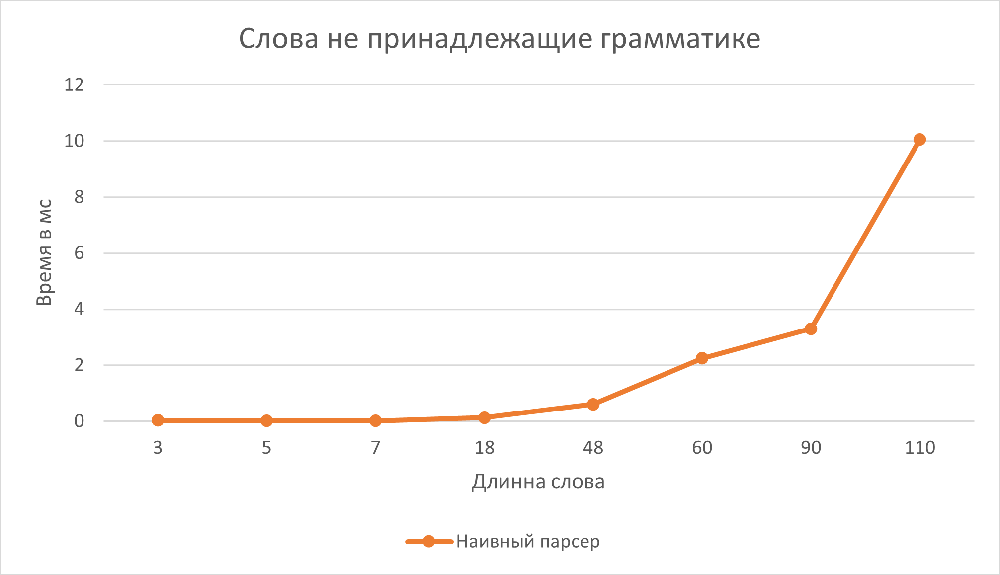
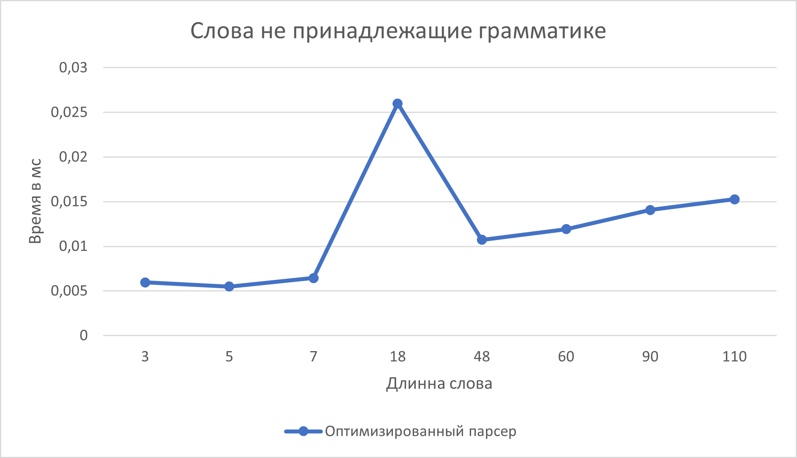

# Лабораторная работа №4

## Атрибутная грамматика 

| Переходы                   | правила                              |
|-------------------------------|-------------------------------------------------|
| \( S -> T_1 a S_1 S_2 a T_2 \) | \( S_1.v = S_2.v \), \( S.v := min(T_1.v, T_2.v) \) |
| \( T -> T_1 a T_2 \)   | \( T.v := T_1.v + T_2.v \)                      |
| \( T -> b b \)            | \( T.v := 1 \)                                  |
| \( S -> a b a \)       | \( S.v := 1 \)                                  |
| \( S -> b b S_1 \)     | \( S.v := 0 \)                                  |

## Задание

- Проанализировать язык на КС-свойство, в случае его наличия — на регулярность.
- Построить "наивный" парсер слов для языка, используя рекурсивный разбор с возвратами. Парсер не должен зацикливаться.
- Построить оптимизированный парсер слов для языка. Оценить сверху его вычислительную сложность.
- Посредством фазз-тестирования проверить эквивалентность парсеров и построить сравнительные графики скорости их работы на случайных словах, принадлежащих языку, и не принадлежащих языку (два тестовых пула).

## Доказательство не-КС свойства

### Выбор слова для накачки

Рассмотрим слово A следующего вида:

A = bba bb(abb)2h-1 a aba aba a bb(abbabb)h bb(abb)2h-1 a aba aba a bb(abbabb)h abb
где:

- T1 и T2 имеют структуру bb(abb)2h-1 и bb(abbabb)h соответсвенно 
- Причем T1.v < T2.v, то есть количество блоков "bb" в T1 меньше, чем в T2

### Слово A пренадлежит языку L

Слово A может выведено с помощью правила S → T a S1 S2 a T, где:

- Где T соответствует "bb"
- S1 -> T1 a aba aba a T2
- S2 -> T1 a aba aba a T2

Рассмотрим структуры T1 и T2

- T1 = bb(abb)2h-1 (его длинна равна p/2, T1.v = 2h)
- T2 = bb(abbabb)h (его длинна длина p/2+3, T2.v = 2h+1)

Причем k < m, так что T1.v < T2.v.

Тогда получается что S1.v = min(T1.v , T2.v) = T1.v 

S2.v = min(T1.v , T2.v) = T1.v

Т.е S1.v = S2.v

Следовательно слово пренадлежит языку

### Применение леммы о накачке для КС-языков

Пусть L — контекстно-свободный язык. Тогда существует константа накачки p.

Рассмотрим произвольное разбиение A = u v x y z, удовлетворяющее условиям леммы:

- |vxy| <= p
- |vy| >= 1

### Случай 1: vxy лежит внутри bb(abb)2h-1

При накачке (например, i = 0) T1 = bb(abb)2h-1 уменьшится, станет T1' = bb(abb)2h-k, где k>1, тогда T1'.v < T1.v. Тогда:

Атрибуты S1.v не равен S2.v следовательно слово вне языка 

### Случай 2: vxy лежит внутри bb(abbabb)h

При накачке (i = 0) чтобы сохранить структуру T2 =  bb(abbabb)h ,  мы уберем минимум 6 символов, т.е длинна T2 уменьшится (станет p/2 - 3), атрибут T2.v = 2h-1 следовательно атрибут T2.v станет меньше T1.v (равен 2h) следовательно равенство атрибутов S1.v и S2.v нарушится и слово не будет пренадлежать языку.

### Случай 3: vxy лежит внутри S1 -> T1 a aba aba a T2

В таком случае, чтобы не нарушть структуру, мы можем только накачивать одновременно T1 = bb(abb)2h-1 и T2 = bb(abbabb)h, но тогда атрибут S1.v изменяется, а S2.v остается неизменным, равенство нарушается, слово не пренадлежит языку 

vxy не может захватить больше чем T1 a aba aba a T2, т.к даже длинна T2T1 равна p+3, а длинна vxy максимум p

### Случай 4: vxy Лежит в T2T1 = bb(abbabb)hbb(abb)2h-1

В таком случае, при нулевой накачке T1 = bb(abb)2h-1 точно уменьшается, т.е опять уменьшается атрибут S2.v, а S1.v остается неизменным, равенство нарушается. Слово не пренадлежит языку.

### Случай 5: vxy охватывает границу между компонентами

Если vxy охватывает часть T1 и часть следующего символа 'a' или часть S = aba, то при накачке может нарушиться структура слова. Т.е при такой накаче слово опять не пренадлежит языку. Аналогично этому случаю во всех остальных случаях накачки слово не будет пренадлежать языку.

**Исходя из всего вышесказанного можем сделать вывод что Атрибутная грамматика не является КС**

## "Наивный" парсер

"Наивный" парсер находится в файле [Parser.py](Parser.py).

## Оптимизированный парсер

Оптимизированный парсер находится в файле  [ParserOPT.py](ParserOPT.py) 

Сложность оптимизированного парсера составляет `O(n^2)` в худшем случае, где `n` — длина входного слова.

## Фазз-тестирование

Код фазз-тестрования находится в файле [Fuzz.py](Fuzz.py). Были построены графики сравнения скорости работы парсеров на словах, принадлежащих языку и не принадлежащих языку.

